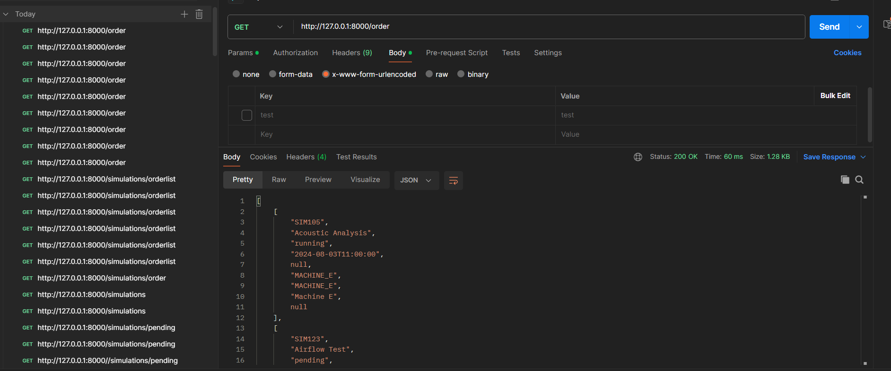

# SimulationOriginAI

como utilizar la app. 

    simplemente desgarga docker y luego ejucuta dockercompose , recuerda modificar el env si es necesario!

Spanish : 

    El test se trata de gestionar simulaciones de herramientas para maquinas
    
        - para cada funcion explico lo que hace en ingles
        - cosas que he utilizado:

            - postgres:
                - He utilizado postgresSql para la base de datos.
                - He utilizado la libreria psycopg2 para connectar a la basede datos en python.
                        - separe las funciones de solicitud de postgres de la apis para hacer una simulacion de MVC.
                        - se hizo una classe de database , he incluido la connexion de base de datos y desconnexion automaticos para no repetir el mismo codigo.
                        - he incluido en la classe commit , rollback cuando se insertan nuevos datos
                        - se hizo funciones para cada probelma presentada , dejando el codigo sea lo mas bastante limpio

            - FastApi
                - He utilizado fastApi porque hice una busqueda que es lo que se utilizaba en la origen y opte por FastApi , espero que sea este framworks :) , la verdad nunca lo he utilizado pero me ha ido bien desarollar las Apis con fastApi aunque si que es verdad que me llevo un timepo por las dificultades.
                tambien tengo algunas preguntas

                - Lo mismo en la base de datos , hice las apis de fast api para cada consulta y he incluido las funcinoes de base de datos para cada api correspondiente 
                - simule cuando se manejan los errores poniendo htmls de 404 y 500 , aunque esten vacios.
                - puse que se devuelva estados de cada funcion 200 , 404 o 500

            - docker
                - he creado un docker compose para instalar dos contenedores para la base de datos y otro para el backend
                - he creado un dockerfile para instalar los requirimientos para que funciones las apis
                    - tenga en cuenta que no lo he probado por los recursos del portatil, he cogido codigo de proyectos anterires y los adapte aqui y con la ayuda de chatgpt lo deje bastante funcional
                - el docker compose debe poder instalar los contendedors y insertar la informacion de base de datos y ejecutar fastApi automaticamente

            - postman
                - utilize postman para hacer las comprobaciones que funcionban las apis , aunque mas tarde descubri fastApi docs

                

            Grafica de datos:
                - en tools he creado una funcion para crear una grafica que gestiona  los datos que obtenemos de la simulacion

english:

    The test is about managing tool simulations for machines

        For each function, I explain what it does in English

        Things I have used:

        PostgreSQL:

        - I used PostgreSQL for the database.
        - I used the library psycopg2 to connect to the database in Python.
        - I separated the PostgreSQL request functions from the APIs to simulate an MVC structure.
        - I created a database class, including automatic database connection and disconnection to avoid repeating the same code.
        - I included commit and rollback in the class when new data is inserted.
        - I created functions for each presented problem, keeping the code as clean as possible.
        FastAPI:

        - I used FastAPI because, after some research, I found it was being used initially, so I chose FastAPI. I had never used it before, but developing APIs with FastAPI went well, though it took some time due to difficulties. I also have some questions.
        Similarly to the database, I made FastAPI APIs for each query and included the database functions for each corresponding API.
        - I simulated error handling by including 404 and 500 HTMLs, even though they are empty.
        - I ensured that each function returns status codes 200, 404, or 500.
        Docker:

        - I created a Docker Compose file to set up two containers, one for the database and another for the backend.
        - I created a Dockerfile to install the requirements for the APIs to function.
            - Keep in mind that I haven't tested it due to the resources of my laptop. I took code from previous projects, adapted it here, and with the help of ChatGPT, made it quite functional.
            - The Docker Compose should be able to set up the containers, insert the database information, and automatically run FastAPI.
        Postman:

        - I used Postman to check if the APIs were working, although I later discovered FastAPI docs.

        

        Data Graph:
        - In tools, I created a function to generate a graph that manages the data obtained from the simulation.

  
            - preguntas
                    1. cuando se hace una solictud a la base de datos , solo se me devlovia una lista sin el nombre para cada variable y entonces accedia desde la posistion de la lista
                    como se puede conseguir que la lista sea un objeto json
                    
                    3. la orginizacion de los archivos no los tengo del todo claro si esta bien organizado o no